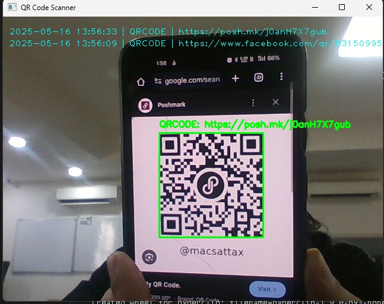

# QR Code Scanner Using Webcam

A Python application that uses your webcam to scan QR codes in real-time. When a QR code is detected, the app will:
- Draw a rectangle around the QR code in the video feed
- Display the decoded data and type on the video
- Play a beep sound for new scans
- Copy the QR data to your clipboard
- Save the scan (with timestamp, type, and data) to a CSV file
- Show the last 10 scans as a history overlay
- Automatically open URLs in your default web browser (only once per unique link)

## Features

- **Real-time QR code detection using your webcam**
- **Automatic URL opening (only once per unique link)**
- **Clipboard copy of scanned data**
- **Beep sound on new scan**
- **Scan history overlay (last 10 scans)**
- **CSV logging of all scans**

## Requirements

- Python 3.7+
- [OpenCV](https://pypi.org/project/opencv-python/)
- [pyzbar](https://pypi.org/project/pyzbar/)
- [pyperclip](https://pypi.org/project/pyperclip/)

## Installation

1. Clone or download this repository.
2. Install dependencies:
    ```
    pip install opencv-python pyzbar pyperclip
    ```

## Usage

Run the main script:
```
python main.py
```

- Press **q** to quit the application.

## Output

- Scanned QR data is saved in `scanned_qr_history.csv`.
- URLs are opened in your default browser only once per session.
- The last 10 scans are shown on the video feed.
- Screenshot

  

## Notes

- The beep sound uses `winsound` and works on Windows.
- Make sure your webcam is connected and accessible.

## License

MIT License

---
